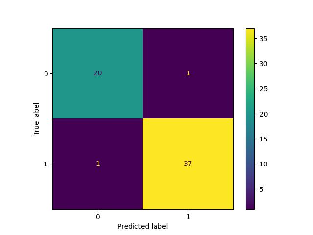

# YouTube-Spam-Collection

The purpose of this repo is to classify comments into the two groups of spam and non-spam. Dataset for this analysis can
be
found:
https://archive.ics.uci.edu/ml/datasets/YouTube+Spam+Collection

# Requirements:

- Python 3.10 (test on 3.8 works fine!)
- Poetry is recommended (also requirement.txt is provided)

To create virtual env using requirement.txt:

```
pip install -r requirement.txt
```

or To create virtual env using poetry:

```
poetry install
```

To run the single executable file you can **main.py**. This will compare and find the best possible model for the
provided
data.

```
python main.py
```

You can change the functionality of the code by changing the configuration file in config folder.

# Introduction

We derived two different datasets from the initial dataset. In the first approach we find the word vector for each word
after the distillation phase and then average them to represent the sentence sentiment, the another approach is use
TF-IDF to weight the presence of each word in the sentence (over all comments) and then calculate the average.

EXTRA TREES CLASSIFIERS and LOGISTIC REGRESSION are used to classify this vectors of dimension 300 based on the CLASS
column which represents Spam and non-spam situation for each comment.

Results demonstrate solid precision and recall simplified EXTRA TREES CLASSIFIERS (~96%) which was selected as the best
model.

# Configuraition file

This file is yaml file and can be found in config/default_settings.yml. Dynaconf library will handle environment
variable injections and interactions.

- Log setting: you can change the format and level of logs generated by this program.
- Dataset: you can add or remove files from this list, possibly you need to be consistent with previous columns
  definition or change the code as needed.
- Random State: make sure the results are reproducible.
- Preprocessing: In this section you can configure the pipeline that manipulate comment data to have better clarity in
  the
  comment (Content) section.
- Modeling: we can change the portion of the train, validation and test dataset as needed, also we can define the search
  grid
  so during the training process
  using training data and validation data to fine-tune hyperparameters and then in it the end compare models based on
  the test
  dataset which is unseen.

```
DEFAULT:

  LOG_SETTING:
    LEVEL: info
    FORMAT: '%(asctime)s - %(name)s - %(levelname)s - %(message)s'
    DATE_FORMAT: '%Y-%m-%d %H:%M:%S %z'

  DATASET:
    CSV_FILES: [ 'Youtube01-Psy.csv',
                 'Youtube02-KatyPerry.csv',
                 'Youtube03-LMFAO.csv',
                 'Youtube04-Eminem.csv',
                 'Youtube05-Shakira.csv',
    ]

  RANDOM_STATE: 42 # set it to zero to disable it

  PREPROCESSING: # change enabled to true and false to disable the component
    DEDUPLICATION_COLUMNS: [ 'COMMENT_ID' ]
    STRIP_TEXT:
      ENABLED: true
    FLAG_YOUTUBE:
      ENABLED: true
    FLAG_URL:
      ENABLED: true
    LOWER_CASE:
      ENABLED: true
    REPLACE_EMOJI:
      ENABLED: true
      NUMBER_OF_PROCESS: 0 # set zero to use all the cores
    REMOVE_SPECIAL_CHARACTERS:
      ENABLED: true
    REMOVE_NUMBERS:
      ENABLED: true
    REMOVE_SHORT_WORD:
      ENABLED: true
    REMOVE_EXTRA_WHITE_SPACE:
      ENABLED: true
    LEMMATIZATION:
      ENABLED: true
      SPACY_MODEL: en_core_web_md
      NUMBER_OF_PROCESS: 1

  MODELING:
    SPACY:
      MODEL: en_core_web_md
      NUMBER_OF_PROCESS: 1
    TF_IDF:
      MAX_DF: 1
      MIN_DF: 1
    SPLIT: # sum of the following numbers should be one
      TRAIN: 0.94
      VAL: 0.03
      TEST: 0.03
    EXTRA_TREES_CLASSIFIERS:
      N_ESTIMATORS: [ 10, 20, 50, 100, 200, 500, 750 ]
      COUNT_DEMO_FALSE_PREDICTION: 2
    LOGISTIC_REGRESSION:
      MAX_ITER: [ 300, 750, 1000 ]
      COUNT_DEMO_FALSE_PREDICTION: 2
```

# Plots

you can find the confusion matrix generated on the test dataset for each approach in the plots folder. here is the best
model results:



# Notebooks

to achieve the results prepared here, three explanatory phase was conducted.

- data-exploration.ipynb: understand data and if the definition presented on the website is correct.
- nlp-investigation.ipynb: check and distil comments and try to get the signal out of the data.
- nlp-modeling.ipynb: modeling phase which is documented for 4 different approaches in total.

# TODO

- add unittests to underlying functions.
- using is_youtube and is_url feature generated during the preprocessing step alongside distilled comments vectors.
- using author historical spam probability and is_url feature generated during the preprocessing step.
- using neural-net to reduce the dimensionally of word embedding and then use the aforementioned features to achieve
  better results.
- implementation of xgboost for this problem, trees/forest are already showing good results for this problem.
- use larger language model, currently we are using 'en_core_web_md'
- data interfaces in different classes can be centralized as a dataclass instead of dictionary to improved readability
  and code completion.
- save model and it's configuration for future use.